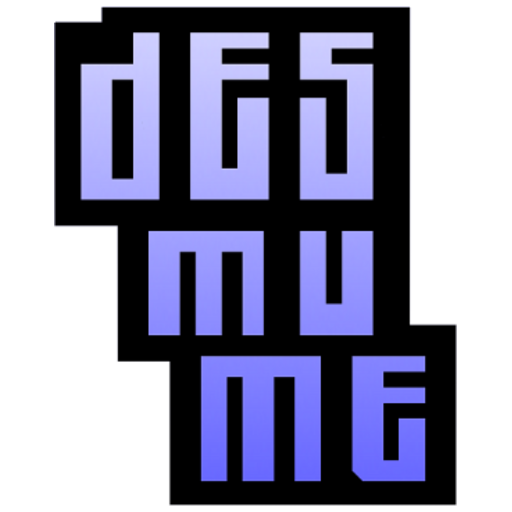

# Nintendo - DS (DeSmuME)

### Description

DeSmuME is software that allows you to emulate a Nintendo DS system.

### License

GPLv2

### Icon

### Fanart

Help make me fanart!

### Screenshots

Help make me screenshots!

### Disclaimer

*Special thanks to yopyop (original author of DeSmuME) and Martin Korth (author of GBATEK)*
